# YBIGTA_newbie_team_project

연세대학교 YBIGTA 27기 여름방학 교육세션 9조 팀플 과제를 위한 repository입니다.

## 팀원 구성 및 자기소개

| 박준서                                                           | 안시연                                                           | 이지민                                                           |
| ---------------------------------------------------------------- | ---------------------------------------------------------------- | ---------------------------------------------------------------- |
|  |  |  |
| [GitHub](https://github.com/Berry-mas)                           | [GitHub](https://github.com/WalkingTiRaMiSu)                     | [GitHub](https://github.com/jimiracle)                           |

#### 박준서

- MBTI : ESFJ
- 학과 : 정치외교학과/응용통계학과
- 취미 : 야구 관람 (LG TWINS 팬입니다!)

#### 안시연

- MBTI : INFP
- 학과 : 건축공학과
- 취미 : 게임하기

#### 이지민

- MBTI : ISTJ
- 학과 : 응용통계학과
- 취미 : 잠자기

### **Git 과제**

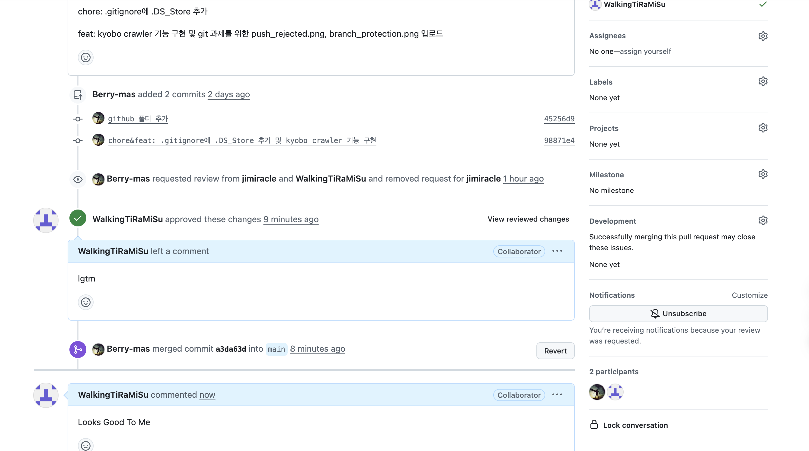 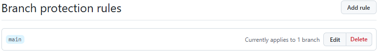 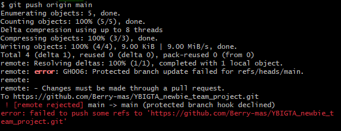

### **크롤링한 리뷰 데이터 소개**

#### 1. 교보문고 (소년이 온다)

- 사이트 링크 : https://product.kyobobook.co.kr/detail/S000000610612
- 데이터 개수 : 501개
- 데이터 형식
  - reviews_kyobo.csv
  - 파일 형식: CSV (쉼표로 구분된 값)
  - 컬럼 구성
    | 컬럼명 | 설명 |
    |--------|--------------------|
    | text | 리뷰 본문 |
    | date | 리뷰 작성일 (yyyy.mm.dd) |
    | score | 리뷰 평점 (예: 10.0) |

#### 2. 알라딘 (소년이 온다)

- 사이트 링크 : https://www.aladin.co.kr/shop/wproduct.aspx?ItemId=40869703
- 데이터 개수 : 590개
- 데이터 형식
  - reviews_aladin.csv
  - 파일 형식: CSV (쉼표로 구분된 값)
  - 컬럼 구성
    | 컬럼명 | 설명 |
    |--------|--------------------|
    | 리뷰 | 리뷰 본문 |
    | 날짜 | 리뷰 작성일 (yyyy-mm-dd) |
    | 별점 | 리뷰 평점 (예: 5) |

#### 3. yes24 (소년이 온다)

- 사이트 링크 : https://www.yes24.com/product/goods/13137546
- 데이터 개수 : 1021개
- 데이터 형식
  - reviews_yes24.csv
  - 파일 형식: CSV (쉼표로 구분된 값)
  - 컬럼 구성
    | 컬럼명 | 설명 |
    |--------|--------------------|
    | review | 리뷰 본문 |
    | day | 리뷰 작성일 (yyyy-mm-dd)s |
    | rate | 리뷰 평점 (예: 평점10점) |
    | Unnamed: 0 | 인덱스 열 |

### 코드 실행 방법

#### 1. Web

YBIGTA_newbie_team_project\app에서
python main.py 을 터미널/Powershell에 입력해주세요.
만약 module을 찾을 수 없다면 같은 위치에서

- Mac/Linux : export PYTHONPATH="../"
- Windows(Powershell 기준) : $env:PYTHONPATH = "../"
  를 입력한 후 python main.py를 입력해주세요.

이후 브라우저에서 http://localhost:8000/docs로 입력하면 api들을 실행할 수 있습니다.

#### 2. 크롤링

YBIGTA_newbie_team_project\review_analysis\crawling에서
python main.py -o ../../database --all을 터미널/Powershell에 입력해주세요.
만약 module을 찾을 수 없다면 같은 위치에서

- Mac/Linux : export PYTHONPATH="../.."
- Windows(Powershell 기준) : $env:PYTHONPATH = "../.."
  를 입력한 후 python main.py -o ../../database --all 을 입력해주세요.

#### 3. EDA/FE

YBIGTA_newbie_team_project\review_analysis\preprocessing에서
python main.py -o ../../database --all을 터미널/Powershell에 입력해주세요.
만약 module을 찾을 수 없다면 같은 위치에서

- Mac/Linux : export PYTHONPATH="../.."
- Windows(Powershell 기준) : $env:PYTHONPATH = "../.."
  를 입력한 후 python main.py -o ../../database --all 을 입력해주세요.

## **EDA&FE, 시각화 설명**

### 1. EDA: 개별 사이트에 대한 시각화 그래프 & 설명

<details>
<summary> kyobo - EDA/FE, 시각화 과제</summary>

### Kyobo EDA

1. 별점 분포
   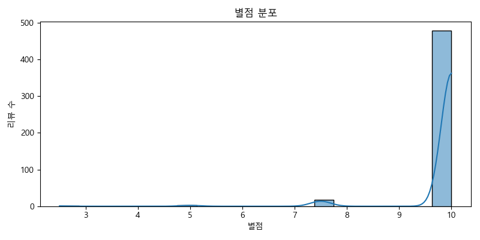

- 분석 내용: 대부분의 리뷰가 **10점(만점)**을 부여하고 있음.

- 특징: 분포의 한쪽에 몰림이 심함. 극단적으로 높은 점수 쏠림 현상.

- 이상치: 3~6점대의 낮은 별점도 소수 존재하나, 전체에서 차지하는 비율은 매우 적음.

- 해석: 해당 도서에 대한 감정적 반응이 매우 강하고 긍정적임. "의무적으로라도 남긴다"는 성격의 리뷰보다는, 책의 메시지에 공감하여 자발적으로 남긴 후기들이 많을 가능성이 큼.

2. 전체 리뷰 길이 분포
   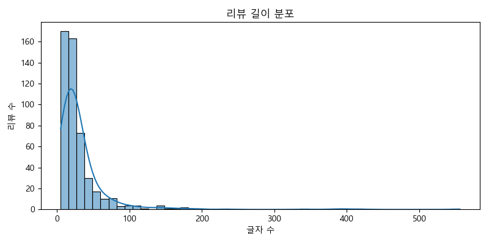

- 분석 내용: 대부분의 리뷰가 20~80자 사이에 집중됨.

- 특징: 길이가 매우 짧거나 매우 긴 리뷰는 극소수에 해당하며, 오른쪽 꼬리가 긴 우측 비대칭 분포를 보임.

- 이상치: 300자 이상의 리뷰는 극히 드물며, 에세이 수준의 심층 리뷰일 가능성이 있음.

- 해석: 독자들은 짧지만 진심을 담은 감상 중심의 리뷰를 남기며, 극소수는 책에 대한 감정을 길게 서술함.

3. 너무 짧은 리뷰 길이 분포 (10자 이하)
   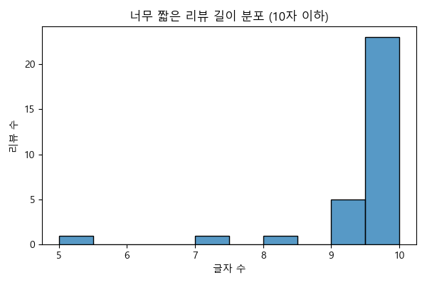

- 분석 내용: 10자 이하의 짧은 리뷰는 전체 중 매우 적은 수.

- 특징: **10자에 가까운 리뷰(9~10자)**가 상대적으로 많고, 그보다 짧은 리뷰는 거의 없음.

- 이상치: 5자 이하 리뷰는 소수이며, 자동 생성 또는 비정상 입력 가능성 있음.

- 해석: 대부분 사용자들이 최소한의 감정을 표현하려는 경향이 있으며, 완전히 무의미한 리뷰는 적음.

4. 날짜별 리뷰 수 변화

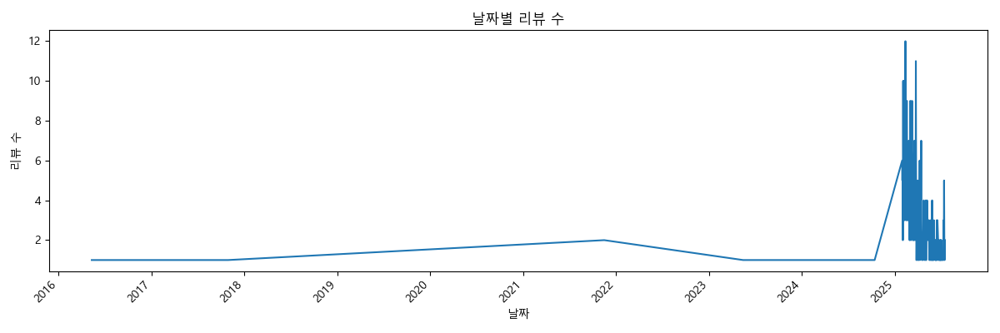

- 분석 내용: 2023년까지는 거의 리뷰가 없고, 2024년 후반~2025년에 급증함.

- 특징: 최근 특정 시점 이후 리뷰가 집중적으로 생성됨.

- 이상치: 2025년 일부 날짜에 급격하게 리뷰 수가 증가한 날들이 존재함.

- 해석: 책의 재조명, SNS나 유튜브 등 외부 영향(콘텐츠, 사회적 이슈 등)에 의해 관심이 급증했을 가능성 있음.
</details>

<details>
<summary> aladin - EDA/FE, 시각화 과제</summary>

### Aladin EDA

1. 별점 분석
   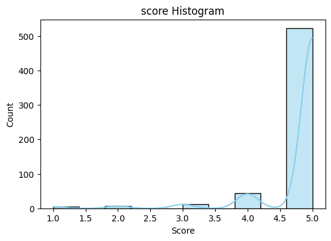
   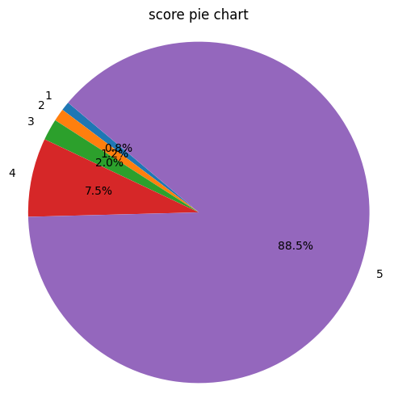

- 별점 5점이 전체의 약 88% 이상을 차지하며 매우 집중되어있고 그 외 점수(1~4)는 극소수에 불과하다.
- 분포가 극단적으로 한쪽으로 쏠려있다.

2. 텍스트 길이 분포

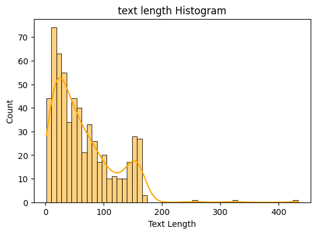

- 대부분의 리뷰는 20자 ~ 150자 내외에 분포하고 드물게 400자 이상의 매우 긴 리뷰도 존재한다.
- 분포가 극단적으로 한쪽으로 쏠려있다.

3. 날짜별 리뷰 수

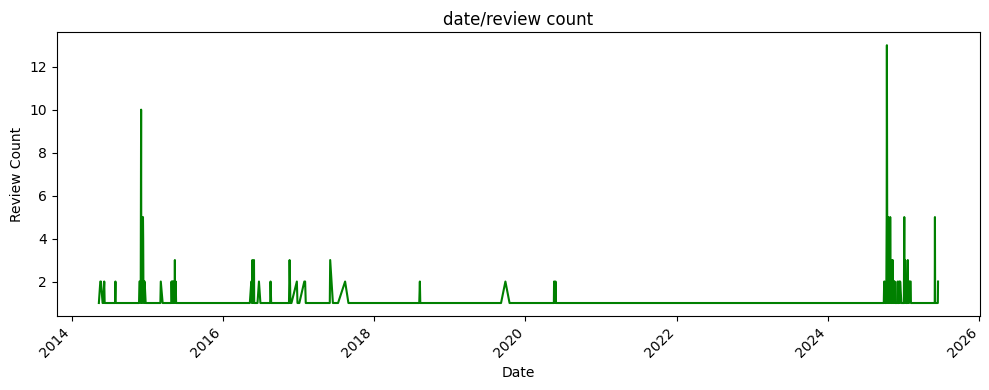

- 2014~2021년까지 꾸준히 리뷰 존재
- 2025년대 이후로 급증

</details>

<details> 
<summary> yes24 - EDA/FE, 시각화 과제</summary>

### yes24 EDA

1. 별점 분석
   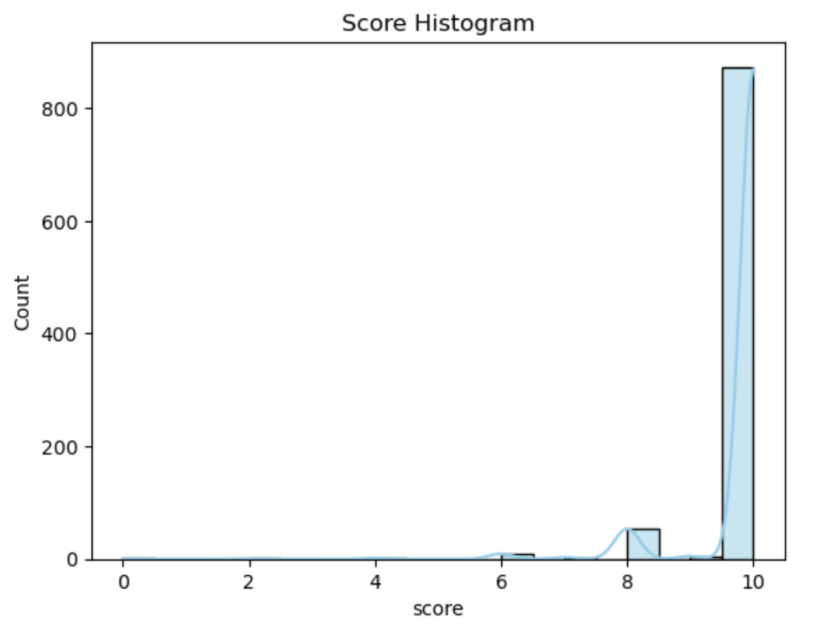

- 전체의 약 92%가 별점 10점으로 평가하였으며 7점 미만이 2%가 채 되지 않는다.

2. 날짜별 리뷰 수
   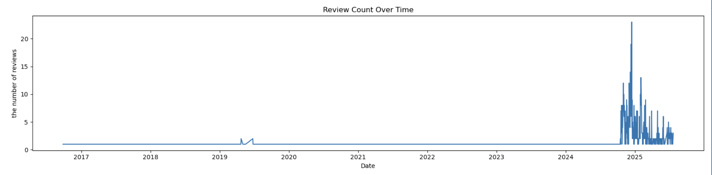

- 대부분이 2024년 후반 2025년 초반에 몰려있다.
- 2019년 중반에도 존재한다.

3. 텍스트 길이 분포
   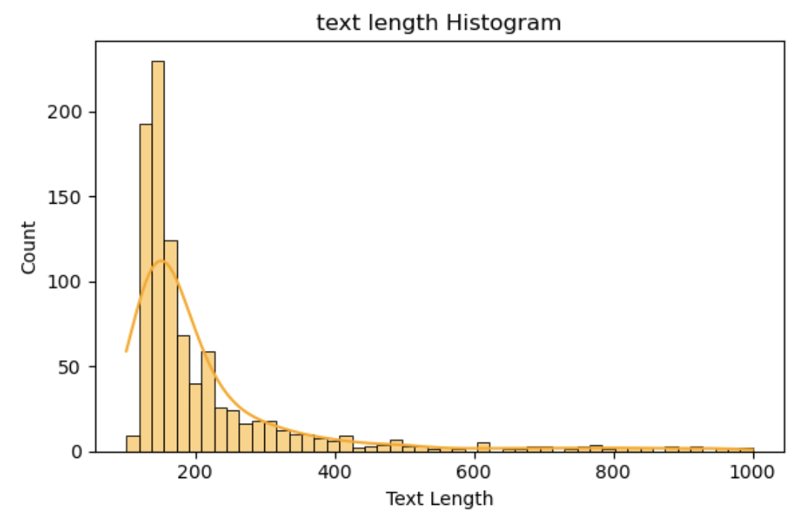

- 대부분 리뷰들의 길이는 200자 이하에 분포해있다.
- 200자 이후로는 리뷰 수가 급격하게 줄어든다.

4. 요일에 따른 리뷰 수
   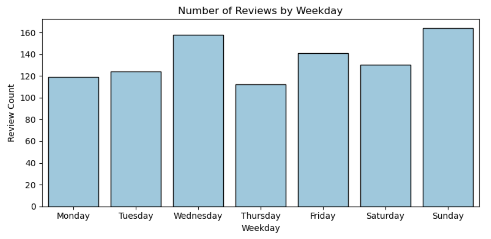

- 전반적으로 모든 요일에 걸쳐 리뷰가 작성되었다.
- 그 중 특히 수요일, 일요일에 약160개의 많은 리뷰가 작성되었다.
</details>

### 2. 전처리/FE: 각 크롤링 csv파일에 대해 진행한 결과 설명

<details> 
<summary> kyobo - Preprocessing / FE </summary>

### kyobo Preprocessing / FE

각 크롤링된 CSV 파일에 대해 진행한 전처리 및 피처 엔지니어링 과정을 설명합니다.  
모든 단계는 모델 입력을 위한 정제 및 벡터화를 목표로 수행되었습니다.

#### 1. 결측치 처리

- `score`, `text`, `date` 컬럼에서 결측값이 존재하는 행은 모두 제거하였습니다.
- 분석 및 벡터화 과정에서 오류를 유발하거나 무의미한 데이터를 제거함으로써 데이터 정합성을 확보했습니다.

#### 2. 이상치 제거

- 리뷰 별점은 원래 1~5 범위였으며, 분석의 일관성을 위해 2배를 곱해 0~10 스케일로 변환하였습니다.
- 이후 다음 조건에 해당하는 데이터를 이상치로 간주하고 제거하였습니다:
  - 별점이 0 미만 또는 10 초과인 경우
  - 리뷰 텍스트의 길이가 5자 미만이거나 1000자 초과인 경우
- 이러한 이상치는 시스템 오류, 자동 생성 리뷰, 의도치 않은 입력 등으로 발생했을 가능성이 있어 제거 대상이 되었습니다.

#### 3. 텍스트 데이터 전처리

- 리뷰 텍스트에서 한글, 숫자, 공백 외의 특수문자를 모두 제거하였습니다.
- 정규표현식을 이용해 불필요한 기호, 이모지, HTML 태그 등을 제거하여 텍스트 분석 품질을 향상시켰습니다.
- 전처리된 텍스트는 `cleaned_text` 컬럼으로 저장하였습니다.

#### 4. 파생변수 생성

- 리뷰 작성 날짜(`date`)로부터 요일 정보를 파생하여 `weekday` 컬럼을 생성하였습니다.
- 이 파생변수는 주말/평일 리뷰 작성 패턴, 소비자 반응 시간대 분석 등에 활용될 수 있습니다.
- 예: Monday, Tuesday, ..., Sunday

#### 5. 텍스트 벡터화 (TF-IDF)

- `cleaned_text` 컬럼을 기반으로 TF-IDF(Term Frequency - Inverse Document Frequency) 벡터화를 수행하였습니다.
- 가장 많이 등장하고 동시에 정보량이 높은 상위 100개의 단어를 기준으로 벡터화하였으며,  
  각 문서는 `tfidf_0 ~ tfidf_99`의 100차원 수치 벡터로 표현됩니다.
- 이 과정은 이후 군집화, 감성 분석, 분류 모델링 등에 사용될 수 있는 정량적 표현을 제공하기 위한 것입니다.
</details>

<details> 
<summary> aladin - Preprocessing / FE </summary>

### Aladin Preprocessing / FE

1. 결측치 처리

- score, text, date 컬럼에서 결측값이 있는 행은 모두 제거

2. 이상치 제거

- 원래 별점이 1 ~ 5 사이였으므로 2배하여 0~10 스케일로 변환하였음
- 범위를 벗어난 별점 점수(<0 또는 >10)는 제거
- 리뷰 텍스트의 길이가 5자 미만 혹은 1000자 초과인 경우 이상치로 간주하여 제거

3. 텍스트 전처리

- 리뷰 텍스트에서 한글, 숫자, 공백 외의 특수문자 제거

4.  파생변수 생성

- 요일(Weekday) : 리뷰가 작성된 날짜에서 요일(Monday, Tuesday, …) 파생, 소비자 행동 패턴(주말/평일)에 따른 분석 가능성 확보

5. 텍스트 벡터화 (TF-IDF)

- cleaned_text 열을 기반으로, 상위 100개의 단어에 대해 TF-IDF 벡터 생성
- 각 문장은 tfidf_0 ~ tfidf_99로 이루어진 100차원 수치 벡터로 변환됨

</details>

<details> 
<summary> yes24 - Preprocessing / FE </summary>

### yes24 Preprocessing / FE

1. 컬럼명 통일
   -score, date, text로 컬럼명 통일

2. 결측치 처리

- 결측치가 있는 행은 모두 제거

2. 이상치 제거

- score 범위 아닌 경우 제거(0~10)
- text의 길이가 5자 미만 or 1000자 초과인 경우 제거

3. 텍스트 전처리

- text에서 한글, 숫자, 공백 외의 특수문자 제거
- rate에서 숫자만 추출(-> 후에 score로 컬럼명 통일)

4.  파생변수 생성

- 요일(Weekday) : date컬럼을 통해 weekday 파생변수 생성

5. 텍스트 벡터화 (TF-IDF)

- cleaned_text 컬럼의 데이터를 기반으로, 상위 100개의 단어에 대해 TF-IDF 벡터 생성
- 각 문장은 tfidf_0 ~ tfidf_99로 이루어진 100차원 수치 벡터로 변환됨

</details>

### 3. 비교분석: 결과에 대한 시각화 그래프 & 설명

#### TF-IDF 상위 단어 분석 결과

1. KYOBO
   

- 상위 단어: 너무, 한강, 감사합니다, 책입니다, 읽고, 작가님, 읽었습니다, 좋아요, 좋은, 정답

- 특징:

  - 감상적 표현이 뚜렷함 (감사합니다, 좋아요, 좋은)

  - ‘책입니다’, ‘읽었습니다’ 등의 정중한 서술형 문장이 많음

  - ‘한강’, ‘작가님’ → 작가 중심의 리뷰 경향

2. ALADIN
   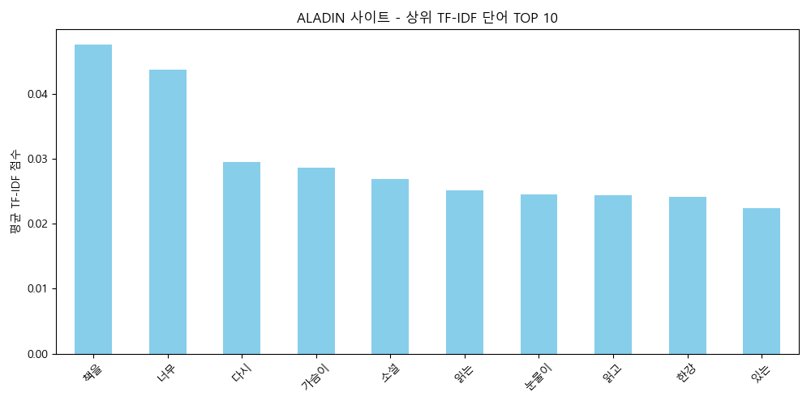

- 상위 단어: 책을, 너무, 다시, 가슴이, 소설, 읽는, 논문이, 읽고, 한강, 있는

- 특징:

  - 감성적 단어(예: 가슴이, 다시, 논문이)가 상위에 포함

  - ‘책을’, ‘읽는’, ‘읽고’ 등 읽기 행위와 관련된 단어가 많이 등장함

  - ‘한강’ 등장으로 미루어 작가 한강을 언급하는 리뷰가 많음

3. YES24
   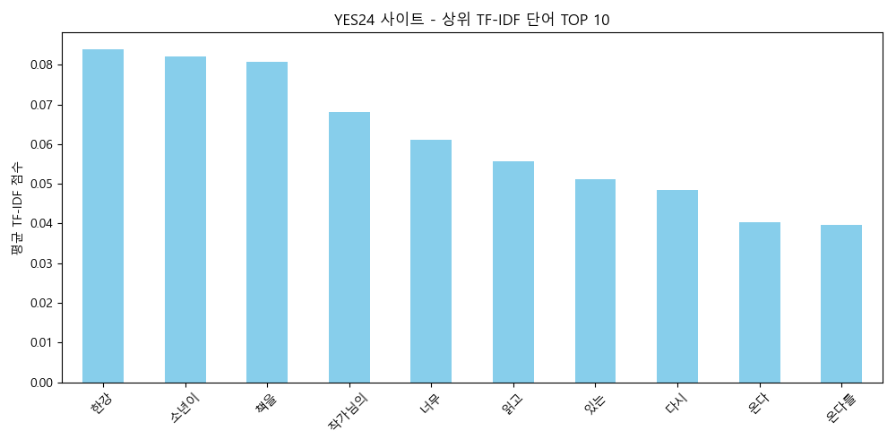

- 상위 단어: 한강, 소년이, 책을, 작가님의, 너무, 읽고, 있는, 다시, 온다, 온다를

- 특징:

  - “소년이 온다”, “온다를” 등 → 특정 작품에 집중된 리뷰 많음

  - ‘작가님의’, ‘읽고’, ‘다시’ 등 작가 존중/반복 감상 분위기 뚜렷

#### 워드클라우드로 본 특징 요약

1. KYOBO
   

- ‘책입니다’, ‘읽었습니다’, ‘감사합니다’, ‘좋아요’ 등 공손한 표현 다수

- 전체적으로 감상 후 느낌을 전하는 공식적인 톤이 강함

2. ALADIN
   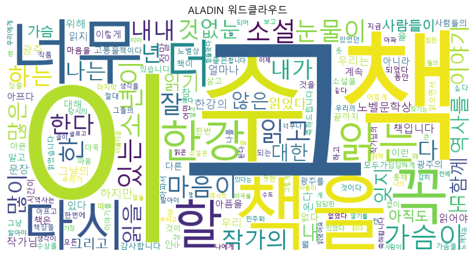

- ‘책을’, ‘소설’, ‘가슴’, ‘읽고’, ‘작가의’ 등 감정이입이 많은 단어 중심
- ‘한강’, ‘광주’, ‘민주주의’ 등의 키워드가 보여 사회적 메시지를 주고자 하는 리뷰가 많아 보임

3. YES24
   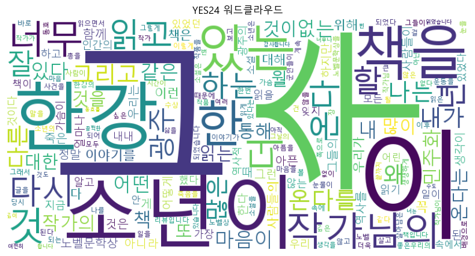

- ‘작가님의’, ‘소년이’, ‘온다’, ‘한강’, ‘읽고’ 등의 단어들이 두드러짐

- 작가 및 작품에 집중된 팬 중심 리뷰가 많아 보임

#### 사이트별 리뷰 수 추이 분석


- 2024년 하반기부터 세 사이트 모두 리뷰 수가 급증

- 이러한 급증은 **2023년 말 한강 작가의 노벨문학상 수상** 이슈와 맞물려,
  작가에 대한 관심이 폭발적으로 증가한 영향으로 해석 가능

- YES24가 다른 사이트 대비 리뷰 수가 가장 많고 꾸준함

- YES24는 리뷰 수가 가장 많고, 증가 폭도 가장 큼

- Aladin은 상대적으로 초반(2015~2020)에도 소수 리뷰가 존재

- 전반적으로 최근 1년 간의 리뷰 데이터가 분석의 핵심 기반

#### 정리 및 향후 계획

- 현재 분석 결과는 불용어를 제거하지 않은 상태로, “있다”, “이다”, “너무” 등의 단어가 상위에 포함되어 있음

- 다음 분석에서는 불용어 제거 및 품사 필터링을 적용하여 더 의미 있는 핵심 키워드와 토픽 중심 분석을 진행할 예정

---

### Docker Hub 주소 : https://hub.docker.com/r/berrymas/ybigta-newbie-team-project

---

### Docker/DB 통합 과제 이미지

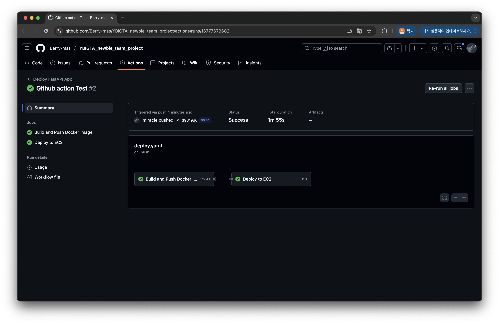
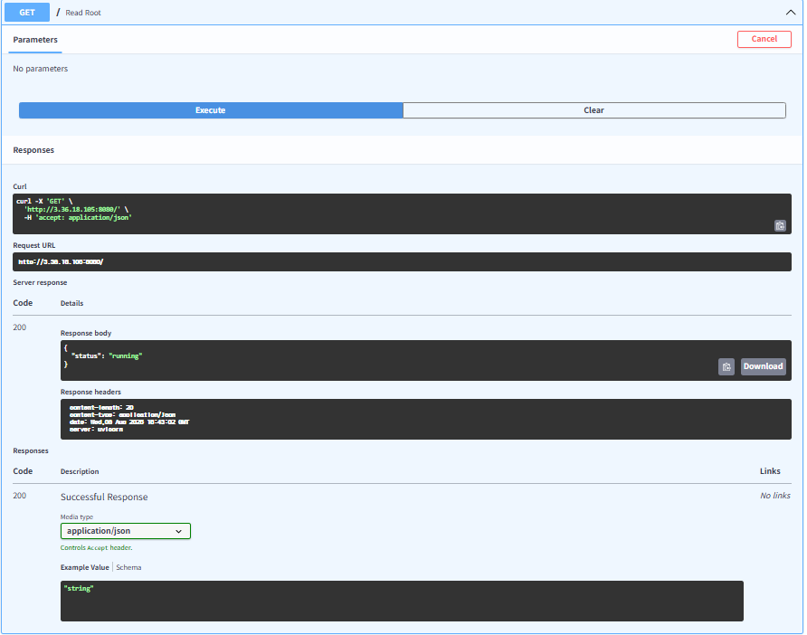
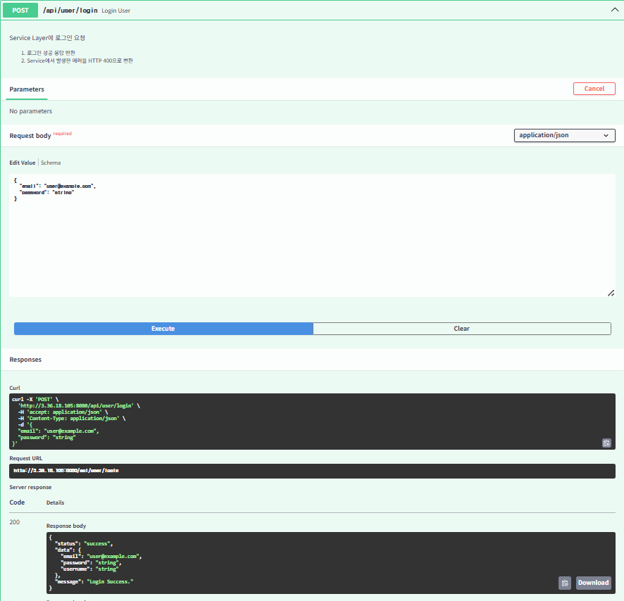
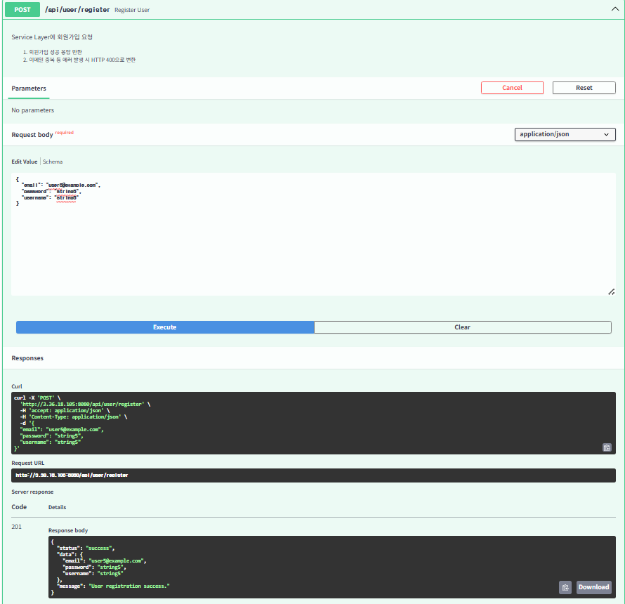
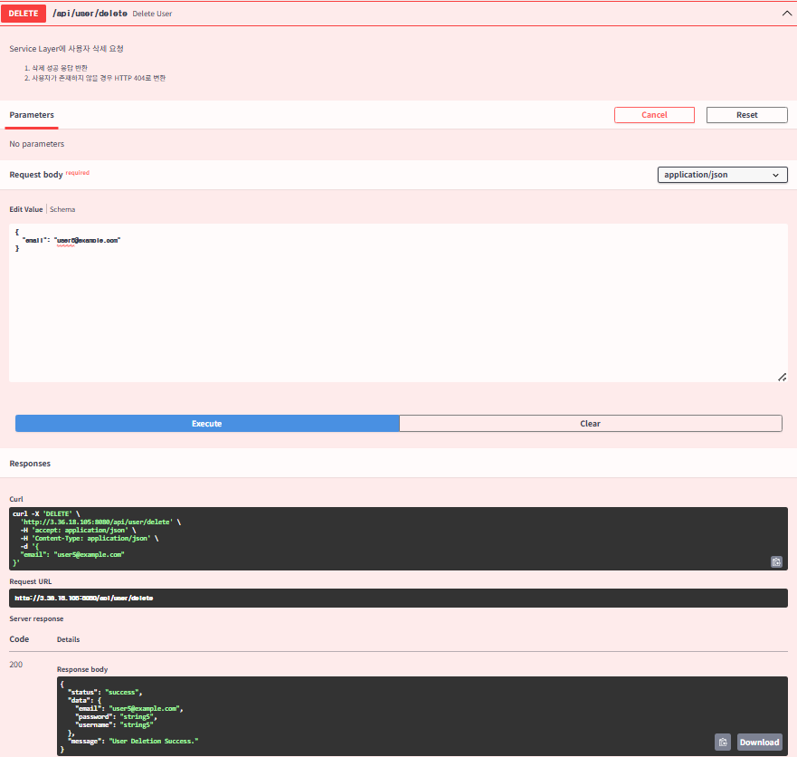
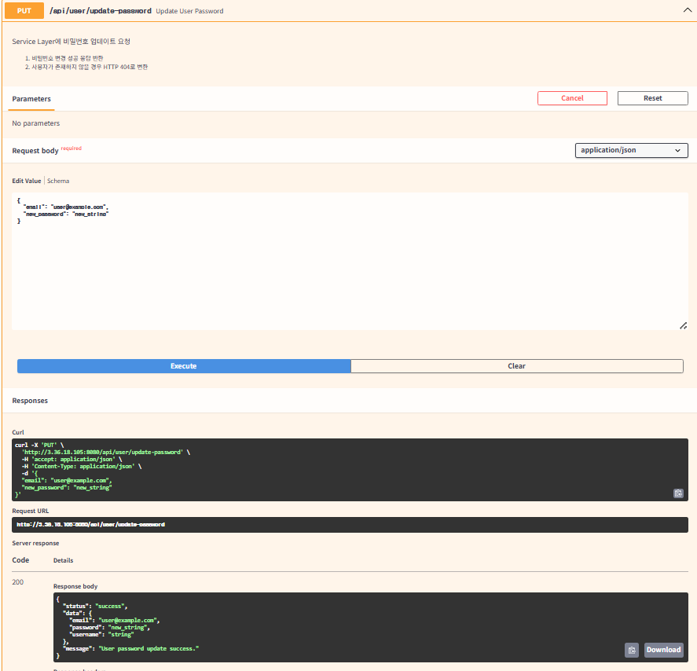
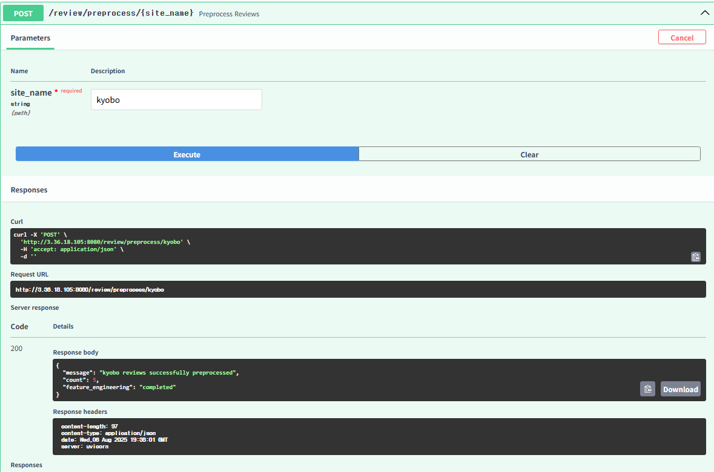

---

## Streamlit Cloud 데모 작동 화면

#### 링크 : https://ybigtanewbieteamproject-g3d4bdbermzuvxfhncvwbo.streamlit.app/

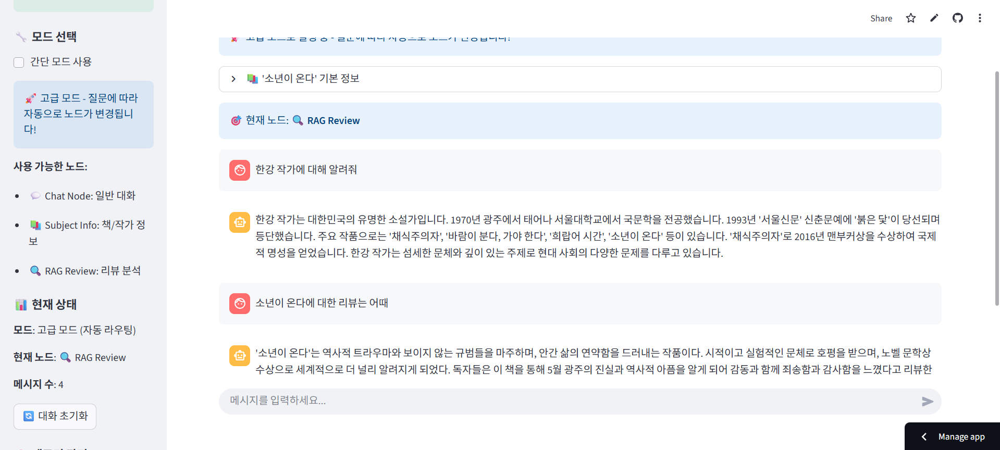

## **State Class 구현 방식**

### 📋 ChatState 클래스 설계

이 프로젝트에서는 대화 흐름의 모든 상태 정보를 관리하기 위해 `st_app/utils/state.py`에 `ChatState` 클래스를 구현했습니다.

#### 🏗️ **구현 특징**

- **Pydantic 기반**: `TypedDict`와 `dataclass`를 활용하여 타입 안정성과 데이터 검증을 보장
- **통합 상태 관리**: 대화 메시지, 라우팅 정보, RAG 결과, 메모리 시스템을 단일 객체로 관리
- **확장 가능성**: 새로운 필드 추가가 용이한 구조 설계

#### 📊 **핵심 필드 구성**

| 필드명              | 타입                       | 설명                                              |
| ------------------- | -------------------------- | ------------------------------------------------- |
| `messages`          | `List[Dict[str, str]]`     | 사용자/어시스턴트 대화 메시지 목록                |
| `current_node`      | `str`                      | 현재 활성화된 노드 (chat/subject_info/rag_review) |
| `last_route`        | `Optional[str]`            | 마지막으로 라우팅된 노드명                        |
| `k`                 | `int`                      | RAG 검색 시 반환할 문서 개수 (기본값: 4)          |
| `citations`         | `List[Dict[str, Any]]`     | RAG에서 참조한 문서 정보                          |
| `error`             | `Optional[Dict[str, Any]]` | 오류 정보                                         |
| `short_term_memory` | `List[MemoryItem]`         | 최근 대화 메모리 (최대 40개)                      |
| `long_term_memory`  | `List[MemoryItem]`         | 중요 정보 장기 메모리 (최대 100개)                |

#### 🧠 **메모리 시스템**

```python
@dataclass
class MemoryItem:
    content: str           # 메모리 내용
    timestamp: float       # 생성 시간
    importance: float      # 중요도 (0.0 ~ 1.0)
    context: Dict[str, Any] # 컨텍스트 정보
```

- **단기 메모리**: 최근 40개의 대화 내용을 임시 저장
- **장기 메모리**: 중요도 0.7 이상의 정보를 30일간 보관
- **자동 정리**: 메모리 크기 제한 및 오래된 데이터 자동 삭제

#### 🔄 **상태 관리 메서드**

- `add_message()`: 대화 메시지 추가 및 메모리 업데이트
- `add_intent()`: 의도 분석 결과 저장
- `get_conversation_history()`: 최근 대화 히스토리 반환
- `get_memory_context()`: 중요 메모리 정보 반환
- `reset()`: 상태 초기화 (메모리는 유지)

---

## **조건부 라우팅 구현 방식**

### 🎯 LLM 기반 지능형 라우팅

이 프로젝트는 LangGraph의 `StateGraph`를 활용하여 **LLM 기반 조건부 라우팅**을 구현했습니다.

#### 🏛️ **아키텍처 구조**

```
START → router → [조건부 분기] → chat/subject_info/rag_review → END
                ↑
            _route_selector
```

#### 🤖 **라우팅 로직**

**1. LLM 의도 분석**

```python
def _decide_route(question: str) -> str:
    llm = get_llm()  # Upstage Solar 모델 사용
    prompt = """
    너는 라우팅 판단자다. 사용자의 질문이 어떤 처리로 가야 할지 '정확히 하나'만 선택해라.
    가능한 선택지: chat | subject_info | rag_review

    규칙:
    - 대상의 기본 정보/스펙/설명/저자/제조사 등을 물으면 subject_info
    - 리뷰/후기/요약/인용 등 사용자 반응을 근거로 한 답변이 필요하면 rag_review
    - 그 외 일반 대화는 chat
    """
    out = llm.invoke(prompt)
    return decision
```
LLM에게 질문을 기반으로 응답을 요청해 라우팅 판단을 요구한다. 

**2. 라우팅 규칙**

- **`subject_info`**: 제품/작품/인물의 기본 정보 요청
- **`rag_review`**: 리뷰/후기 기반 답변 요청
- **`chat`**: 일반 대화 및 기타 질문
로 구분한다. 

#### 🛡️ **안정적인 LLM 기반 라우팅을 위한 안전장치**

**1. LLM 출력 정규화**

```python
decision = decision_raw.lower().replace(" ", "").replace("\n", "").strip('\"\'')
```

**2. 키워드 기반 폴백**

```python
# LLM이 실패할 경우 키워드 매칭으로 폴백
if any(kw in q for kw in ["리뷰", "후기", "요약", "인용"]):
    return "rag_review"
if any(kw in q for kw in ["정보", "스펙", "특징", "저자", "작가"]):
    return "subject_info"
```

**3. 기본값 처리**

- LLM이 명확한 의도를 판별하지 못하거나 허용되지 않는 값을 반환할 경우
- 무조건 `chat` 노드로 폴백하여 안전한 대화 진행

---
## **draw.io 전체 로직**

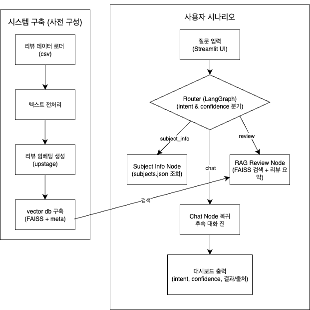
